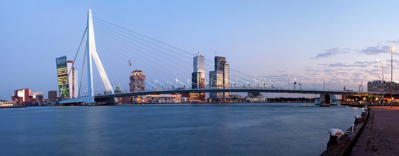

::: {.lead}

*Workshop on response force measurements for psychological research*

::: {.centering .large}
**September 7th & 8th 2026**  
**Erasmus University Rotterdam**
:::
:::

The meeting aims to bring together researchers from disciplines to discuss the latest developments in response force measurements and to foster future collaboration. I'm looking forward to welcoming you to Rotterdam in September 2026.

::: {.centering}
# Monday 7. 9. 2026
:::

**10:00 – 15:00**   **Methodological Challenges and Open Issues in Force Data Analysis**

|  |   |            |
|----------- | ---------------- | -------------------------------------------------------------------------------------------------------------------------------------- |
|  | 10:00 | *Florentin Vandeville, Université Catholique de Lille, France*   Force Measurements in Cognitive Psychology: A Systematic Overview |
|  | 11:15 | *Oliver Lindemann, University of Rotterdam, Netherlands*   Analyzing Behavioral Force Data: Best Practices for Preprocessing and Statistical Challenges |
|  | 13:00 | LUNCH BREAK                                              |
|  | 14:00 | *Olivier Capra, Université Catholique de Lille, France*   Bayesian approaches to Statistical Analysis of Force Data              |

**15:30 - 17:30 Visit of the Erasmus Behavioural Lab and Practical session**

::: {.gray-text}
18:30 Leisurely walk to restaurant (Starting Ibis Hotel Wijnhaven) 
19:30 Dinner (Humphrey’s Restaurant, Otto Reuchlinweg)
:::

::: {.centering}
# Tuesday 8. 9. 2026
:::

**9:30 – 12:30**   **From Data to Theory: Applications and Implications of Response Force Measurements in Research**

|  |   |            |
|----------- | ---------------- | -------------------------------------------------------------------------------------------------------------------------------------- |
|  | 9:30	| *Claudia Gianelli, University of Messina, Italy*   Grip force and beyond: complementary and alternative measures of cognitive dynamics |
|  | 10:45	| *Martin Fischer, University of Potsdam, Germany*   Widening our Grasp of Cognition |
|  | 12:30	| LUNCH BREAK |

**13:00 – 14:30**
**Coordination Meeting: Strategies, Collaborations and Grant Proposals**

::: {.gray-text}
15:00 Sightseeing Rotterdam
:::